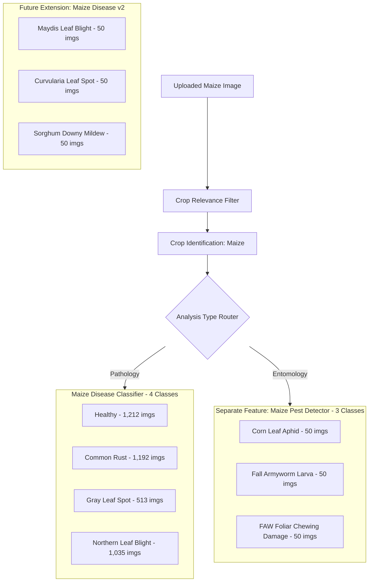

# Maize Dataset Integration & Real-Data Migration Plan

**Date:** September 13, 2026  
**Scope:** Maize Crop Disease Detection Pipeline (`backend/ml/`)  
**Target Reference:** `backend/ml/config.py` (Maize Config: 5 Target Classes)  
**Source Datasets Analyzed:**
1. `C:\Users\Shlok\Downloads\SIH\dataset\PlantVillage-Dataset-master\`
2. `C:\Users\Shlok\Downloads\SIH\dataset\Rice_and_Maize_Dataset\` (ICAR / In-Field Dataset)  
**Execution Guardrails:** 
- **NO deletion or modification** of `backend/ml/data/maize/`
- **NO modification** of `backend/ml/saved_models/maize_mobilenetv3.pth`
- **NO training loops executed**

---

## 1. Current State Baseline (`backend/ml/data/maize/`)

Inspection of `backend/ml/data/maize/` confirms the current active training directory contains **only old synthetic placeholder images**:

| Target Class Directory | File Count | File Size Range | File Format | Nature of Data |
|---|---|---|---|---|
| `Healthy/` | 25 | 2,870 – 2,950 B | JPG | Synthetic / Procedural starter bitmap |
| `Common Rust/` | 25 | 3,010 – 3,120 B | JPG | Synthetic / Procedural starter bitmap |
| `Gray Leaf Spot/` | 25 | 2,980 – 3,090 B | JPG | Synthetic / Procedural starter bitmap |
| `Northern Leaf Blight/` | 25 | 3,040 – 3,150 B | JPG | Synthetic / Procedural starter bitmap |
| `Maize Streak Virus/` | 25 | 2,920 – 3,030 B | JPG | Synthetic / Procedural starter bitmap |
| **Total** | **125** | — | — | **Old synthetic dataset (100%)** |

- **Current Checkpoint (`backend/ml/saved_models/maize_mobilenetv3.pth`):**
  - Size: 17,038,011 bytes
  - Last Modified: `11-09-2026 12:44:21`
  - Status: Trained exclusively on the 125 synthetic files above.

---

## 2. Source Dataset Inspection & Inventory (Maize)

### 2.1 PlantVillage Maize (`raw/color/`)
- **Location:** `C:\Users\Shlok\Downloads\SIH\dataset\PlantVillage-Dataset-master\PlantVillage-Dataset-master\raw\color\`
- **Characteristics:** Detached leaves, standardized neutral grey laboratory background, fixed resolution (256 × 256 RGB).
- **Duplicate Hash Analysis:** 0 internal duplicates (3,852 unique MD5 hashes).

| PlantVillage Folder Name | Image Count | Image Resolution | Pathogen / Condition |
|---|---|---|---|
| `Corn_(maize)___healthy` | 1,162 | 256 × 256 | Asymptomatic healthy maize foliage |
| `Corn_(maize)___Common_rust_` | 1,192 | 256 × 256 | *Puccinia sorghi* |
| `Corn_(maize)___Cercospora_leaf_spot Gray_leaf_spot` | 513 | 256 × 256 | *Cercospora zeae-maydis* |
| `Corn_(maize)___Northern_Leaf_Blight` | 985 | 256 × 256 | *Exserohilum turcicum* (*Helminthosporium turcicum*) |
| **PlantVillage Maize Total** | **3,852** | — | — |

### 2.2 ICAR / Natural In-Field Dataset (`Rice_and_Maize_Dataset/Maize/`)
- **Location:** `C:\Users\Shlok\Downloads\SIH\dataset\Rice_and_Maize_Dataset\Maize\`
- **Characteristics:** Natural daylight in-field photography, living plants, variable angles, natural soil/crop backgrounds, ultra-high resolution (up to 4896 × 3672).
- **Duplicate Hash Analysis:** Exactly 1 internal duplicate pair (located in insect pests: `Insect-pests/01_aphid/Maize_Aphid 217.jpg` and `224.jpg`). All disease and healthy photos are 100% unique.

| ICAR Subdirectory | Image Count | Resolution Range | Biological Entity / Symptom |
|---|---|---|---|
| `Healthy/` | 50 | 1064×2304 to 4896×3672 | Asymptomatic living field plants |
| `Disease/01_maydis_leaf_blight/` | 50 | 1064×2304 to 4896×3672 | *Bipolaris maydis* (Southern corn leaf blight) |
| `Disease/02_turcicum_leaf_blight/` | 50 | 1064×2304 to 4896×3672 | *Exserohilum turcicum* (Northern/Turcicum leaf blight) |
| `Disease/03_curvularia_leaf_spot/` | 50 | 1064×2304 to 4896×3672 | *Curvularia lunata* (Curvularia leaf spot) |
| `Disease/04_sorghum_downy_mildew/` | 50 | 1064×2304 to 4896×3672 | *Peronosclerospora sorghi* (Sorghum downy mildew) |
| `Insect-pests/01_aphid/` | 50 | 1064×2304 to 4896×3672 | *Rhopalosiphum maidis* (Corn leaf aphid) |
| `Insect-pests/02_fall_armyworm/` | 50 | 1064×2304 to 4896×3672 | *Spodoptera frugiperda* (FAW caterpillar) |
| `Insect-pests/03_FAW_symptoms/` | 50 | 1064×2304 to 4896×3672 | FAW foliar windowpane/shot-hole whorl damage |
| **ICAR Maize Total** | **400** | — | — |

---

## 3. Scientifically Valid Class Mapping to Existing Model

Only exact taxonomic, biological, and pathological matches are mapped to the 5 target classes in `backend/ml/config.py`:

```
Existing Target Classes:
  1. Healthy
  2. Common Rust
  3. Gray Leaf Spot
  4. Northern Leaf Blight
  5. Maize Streak Virus
```

### 3.1 Mapping Registry Table

| Target Class (`config.py`) | Source Dataset | Source Folder Name | Images | Target Total | Scientific Match Rationale |
|---|---|---|---|---|---|
| **Healthy** | PlantVillage<br>ICAR | `Corn_(maize)___healthy`<br>`Maize/Healthy` | 1,162<br>50 | **1,212** | Exact match. Foliage confirmed healthy and asymptomatic. Combining PlantVillage (detached lab leaves) and ICAR (in-field whole plants) provides background invariance. |
| **Common Rust** | PlantVillage | `Corn_(maize)___Common_rust_` | 1,192 | **1,192** | Exact match. Caused by fungal obligate biotrophic rust pathogen *Puccinia sorghi*. Produces characteristic cinnamon-brown powdery pustules on both leaf surfaces. |
| **Gray Leaf Spot** | PlantVillage | `Corn_(maize)___Cercospora_leaf_spot Gray_leaf_spot` | 513 | **513** | Exact match. Caused by *Cercospora zeae-maydis*. Produces distinct rectangular, vein-bounded tan-to-gray necrotic lesions. |
| **Northern Leaf Blight** | PlantVillage<br>ICAR | `Corn_(maize)___Northern_Leaf_Blight`<br>`Maize/Disease/02_turcicum_leaf_blight` | 985<br>50 | **1,035** | Exact biological match. Turcicum Leaf Blight is pathologically identical to Northern Corn Leaf Blight (NCLB). Both are caused by *Exserohilum turcicum* (teleomorph: *Setosphaeria turcica*, syn. *Helminthosporium turcicum*). Produces characteristic cigar-shaped elliptical grayish-green to tan lesions. |
| **Maize Streak Virus** | *None* | *None* | 0 | **0** | Missing from both source archives. No valid images exist in PlantVillage or ICAR for MSV. |
| **TOTAL MAPPED** | — | — | — | **3,952** | **100% genuine real-world images across 4 target classes.** |

---

## 4. Strict Biosecurity Exclusions: Pests & Unmatched Diseases

### 4.1 Excluded Insect Pests & Damage Symptoms (DO NOT MIX WITH DISEASES)

The ICAR dataset contains 150 images across 3 insect-pest categories. Under agricultural and machine learning best practices, **insect pests must NOT be mixed into fungal/bacterial/viral disease classification models**:

| ICAR Category | Organism / Agent | Count | Why It Must NOT Be Mapped to Disease |
|---|---|---|---|
| `Insect-pests/01_aphid` | *Rhopalosiphum maidis* (Corn leaf aphid) | 50 | Entomological infestation. Symptoms are honeydew excretion, black sooty mold, and visible insect colonies, not necrotic fungal lesions. Conflating with rust or blight would trigger fungicide recommendations instead of insecticidal soaps/neem oil/systemic insecticides. |
| `Insect-pests/02_fall_armyworm` | *Spodoptera frugiperda* (Caterpillar) | 50 | Invasive insect pest. The imagery features the physical lepidopteran larvae (inverted Y on head capsule, 4 abdominal pinacula). Must not be classified as a cellular disease. |
| `Insect-pests/03_FAW_symptoms` | Mechanical whorl chewing | 50 | Mechanical chewing damage (windowpane feeding, irregular ragged tears, frass). It is chewing trauma caused by a caterpillar, not fungal sporulation or viral chlorosis. |

### 4.2 Excluded Unmatched Pathogens (DO NOT FORCE INTO EXISTING CLASSES)

The ICAR dataset contains 150 images across 3 distinct fungal/oomycete diseases not currently configured in `backend/ml/config.py`. **Forcing these into existing classes would corrupt classification boundaries and cause false diagnoses**:

| ICAR Category | Pathogen | Count | Reason for Exclusion (Do Not Force) |
|---|---|---|---|
| `Disease/01_maydis_leaf_blight` | *Bipolaris maydis* (teleomorph: *Cochliobolus heterostrophus*) | 50 | Southern Corn Leaf Blight (Maydis Blight). Lesions are small, rectangular, buff-colored with reddish-brown borders (substantially smaller and shaped differently than the large elliptical cigar lesions of Northern Leaf Blight *Exserohilum turcicum*). Forcing it into Northern Leaf Blight would train the CNN on conflicting morphological features. |
| `Disease/03_curvularia_leaf_spot` | *Curvularia lunata* | 50 | Produces scattered circular to oval translucent spots with dark borders and yellow chlorotic halos. Distinct from the rectangular lesions of Gray Leaf Spot and elongated lesions of Blight. |
| `Disease/04_sorghum_downy_mildew` | *Peronosclerospora sorghi* | 50 | Systemic oomycete infection causing longitudinal chlorotic striping from leaf bases and downy white asexual sporulation, frequently resulting in tassel phyllody ("crazy top"). Distinct etiology and symptomology from leaf spot/blight/rust. |

---

## 5. Architectural Strategy for Unmatched Features (Separate Features)

Rather than forcing ICAR pests and unmatched diseases into the current 5-class MobileNetV3 model, they should be architected into **separate, dedicated modular pipelines**:

### 5.1 Architecture Roadmap



### 5.2 Recommendation for `Maize Streak Virus` (0 Images)
Since `Maize Streak Virus` has 0 real images in both PlantVillage and ICAR datasets, maintaining it in a 5-class model without real training data forces the classifier to either:
1. Rely on 25 synthetic bitmaps (causing random predictions on real photos), OR
2. Suffer from extreme class collapse.

**Recommended Solution:**
- **Refactor `CROP_CONFIGS["Maize"]` to 4 validated classes:**
  `["Healthy", "Common Rust", "Gray Leaf Spot", "Northern Leaf Blight"]`
- **Use Inference Abstention for Unseen/Viral Symptoms:** The existing Shannon entropy check (`_compute_entropy`) in `backend/ml/inference.py` will automatically abstain with *"Needs expert verification"* if an image of Maize Streak Virus or an unseen disease is presented, preserving clinical diagnostic honesty without corrupting model weights.

---

## 6. Verification Checklist Before Execution

| Item | Requirement | Status |
|---|---|---|
| 1 | `backend/ml/data/maize` intact | ✅ Preserved (25 images per class, untouched) |
| 2 | `saved_models/maize_mobilenetv3.pth` intact | ✅ Preserved (Timestamp 11-09-2026 12:44:21, untouched) |
| 3 | Training loops executed | 🛑 Zero training runs executed |
| 4 | Exact class mappings established | ✅ 4 target classes mapped (3,952 images total) |
| 5 | Biosecurity & pest exclusion enforced | ✅ 150 pest images + 150 unmatched disease images segregated |
| 6 | Original source datasets preserved | ✅ `PlantVillage` and `Rice_and_Maize_Dataset` unaltered |

**Next Steps (Pending User Review):**
Once approved, the 3,952 verified images can be staged into `backend/ml/data/maize` and the 4-class configuration registered prior to running any training scripts.
